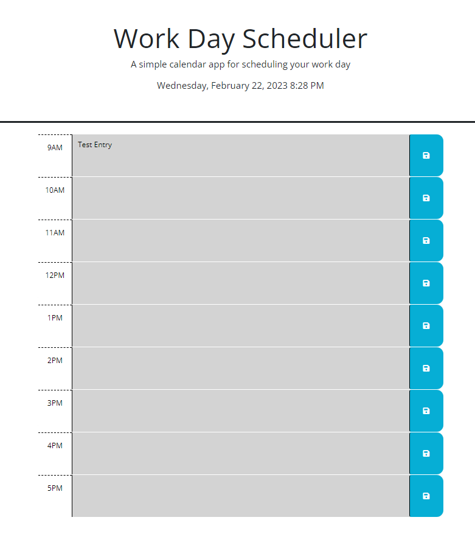

# Daily Planner

## Description
Create a website that displays a planner for today and is able to save events.

## Installation
N/A

## Usage

https://deweywatkins77.github.io/dailyplanner
will take you to the webpage shown below.

Date and time is displayed at the top. User is able to save events to local storage. If events have been saved they will be populated once the page loads. If user deletes an event and clicks save it is removed from the planner and cache.
Planner is color coded, past time sections are grey, current time section is red, and anything in the future is green.

## License

Refer to Repository License.
